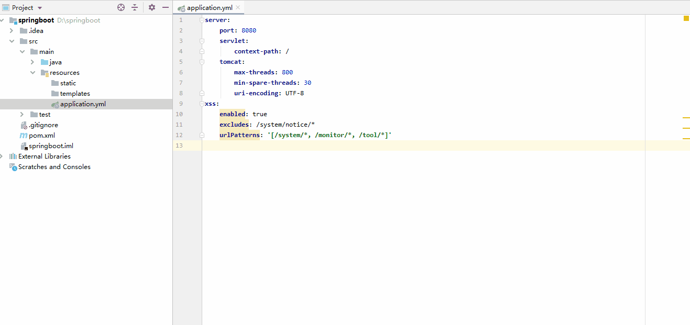

# Convert Yaml And Properties Files

> You can quickly convert Properties files to YAML files, or YAML files to Properties files

[Github](https://github.com/chencn/ConvertYamlAndProperties)  |  [Gitee](https://gitee.com/xqchen/ConvertYamlAndProperties)  |  [JetBrains Plugin Download](https://plugins.jetbrains.com/plugin/13804-convert-yaml-and-properties-file)

